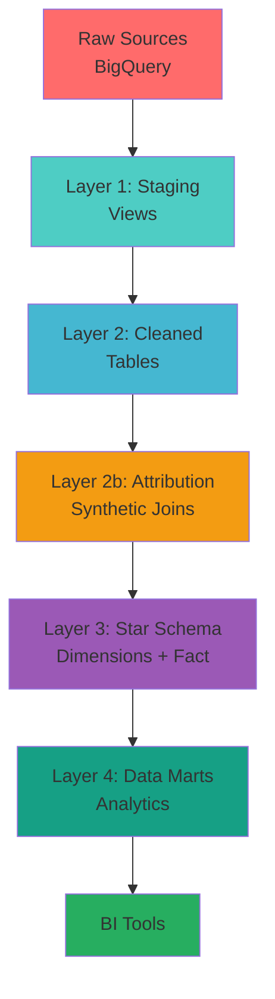

<div align="center">

# 🏥 Health Insurance Data Warehouse

### Complete Enterprise Data Warehouse with Dimensional Modeling & Analytics

[](https://www.getdbt.com/)
[](https://cloud.google.com/bigquery)
[](https://www.python.org/)
[](https://github.com)

<p align="center">
  <strong>5-layer data warehouse built with dbt and BigQuery</strong><br>
  Featuring star schema, data marts, 39+ automated tests, and comprehensive analytics
</p>

[Features](#-features) • [Quick Start](#-quick-start) • [Architecture](#-architecture) • [Star Schema](#-star-schema) • [Data Marts](#-data-marts)

---

</div>

## 🎯 Overview

This project delivers a **complete enterprise data warehouse** for health and insurance analytics with 5 architectural layers: staging, cleaned, attribution, dimensional (star schema), and analytics (data marts).

### ✨ Highlights

<table>
<tr>
<td width="50%">

**🏗️ 5-Layer Architecture**
- Staging → Cleaned → Attribution → Star Schema → Data Marts
- 18 dbt models across 5 BigQuery datasets
- ~94,000 rows in fact table
- Full dimensional modeling

</td>
<td width="50%">

**🧪 Comprehensive Testing**
- 39+ automated quality tests
- Primary & foreign key validation
- Referential integrity checks
- Range & business rule validation

</td>
</tr>
<tr>
<td width="50%">

**📊 Star Schema & Data Marts**
- 3 dimension tables + 1 fact table
- 5 pre-aggregated analytics tables
- Customer 360 view with risk scoring
- BI-ready for Looker/Tableau/Power BI

</td>
<td width="50%">

**📚 Production-Grade Docs**
- 13+ markdown documentation files
- Architecture diagrams & lineage
- Role-based navigation guides
- Complete deployment instructions

</td>
</tr>
</table>

---

## 🏗️ Architecture

### **Complete 5-Layer Data Warehouse**



### 📦 Complete Data Pipeline Flow

```
┌─────────────────────────────────────────────────────────┐
│         LAYER 0: RAW SOURCES (4 tables)                 │
│  raw_dataset                                            │
│    ├── Sleep Health (374 rows)                          │
│    ├── Smartwatch Data (10,001 rows)                    │
│    ├── Insurance Person (124 rows)                      │
│    └── Insurance Facts (365 rows)                       │
└────────────────────┬────────────────────────────────────┘
                     │
                     ▼
┌─────────────────────────────────────────────────────────┐
│       LAYER 1: STAGING (4 views)                        │
│  raw_dataset_staging                                    │
│    • Type casting & column renaming                     │
│    • Minimal transformation                             │
└────────────────────┬────────────────────────────────────┘
                     │
                     ▼
┌─────────────────────────────────────────────────────────┐
│       LAYER 2: CLEANED (5 tables)                       │
│  raw_dataset_cleaned                                    │
│    • Deduplication & validation                         │
│    • 39+ automated tests                                │
│    • Quality flags & standardization                    │
│    • Attribution table (~94K rows)                      │
└────────────────────┬────────────────────────────────────┘
                     │
                     ▼
┌─────────────────────────────────────────────────────────┐
│       LAYER 3: STAR SCHEMA (4 tables)                   │
│  raw_dataset_star_schema                                │
│    ├── dim_person (72 rows)                             │
│    ├── dim_occupation (36 rows)                         │
│    ├── dim_insurance (97 rows)                          │
│    └── fact_health_metrics (~94K rows)                  │
└────────────────────┬────────────────────────────────────┘
                     │
                     ▼
┌─────────────────────────────────────────────────────────┐
│       LAYER 4: DATA MARTS (5 tables)                    │
│  raw_dataset_data_marts                                 │
│    ├── dm_health_by_demographics                        │
│    ├── dm_insurance_profitability                       │
│    ├── dm_sleep_health_analysis                         │
│    ├── dm_customer_360                                  │
│    └── dm_data_quality_dashboard                        │
└────────────────────┬────────────────────────────────────┘
                     │
                     ▼
           ┌──────────────────────┐
           │   BI TOOLS & APPS    │
           │  • Looker            │
           │  • Tableau           │
           │  • Power BI          │
           └──────────────────────┘
```

---

## 🚀 Quick Start

### Prerequisites

```bash
# Install dbt with BigQuery adapter
pip install dbt-bigquery

# Verify installation
dbt --version
```

### Setup in 3 Steps

**1️⃣ Clone & Navigate**
```bash
git clone https://github.com/njaltran/health-insurance-data-warehouse.git
cd health-insurance-data-warehouse/dbt_health_insurance
```

**2️⃣ Configure BigQuery**

Create `~/.dbt/profiles.yml`:

```yaml
health_insurance:
  target: dev
  outputs:
    dev:
      type: bigquery
      method: oauth
      project: your-project-id  # ← Update this
      dataset: raw_dataset
      threads: 4
      location: EU
```

**3️⃣ Install & Run Complete Pipeline**

```bash
# Install dbt packages
dbt deps

# Test connection
dbt debug

# Run complete pipeline (all 5 layers)
dbt run

# Execute quality tests
dbt test

# Generate & view documentation
dbt docs generate && dbt docs serve
```

**Expected Output:**
```
✅ 4 staging views created
✅ 5 cleaned tables created (4 cleaned + 1 attribution)
✅ 4 star schema tables created (3 dimensions + 1 fact)
✅ 5 data marts created
✅ 39+ tests passed
✅ Documentation generated
```

---

## 📊 Star Schema

### **Dimensional Model (Kimball Methodology)**

<div align="center">

```
         ┌─────────────┐
         │ dim_person  │
         │  (72 rows)  │
         └──────┬──────┘
                │
                │
        ┌───────▼───────────────────┐
        │                           │
  ┌─────▼──────┐         ┌──────────▼────────┐
  │dim_occupation│◄──────│fact_health_metrics│──────►│dim_insurance│
  │  (36 rows)  │        │   (~94K rows)     │       │  (97 rows)  │
  └─────────────┘        └───────────────────┘       └─────────────┘
```

</div>

### **Dimensions**

| Dimension | Rows | Primary Key | Grain |
|-----------|------|-------------|-------|
| **dim_person** | 72 | PersonID | One row per person |
| **dim_occupation** | 36 | occupation_id | One row per occupation-wealth combo |
| **dim_insurance** | 97 | insurance_id | One row per insurance status-date combo |

### **Fact Table**

**fact_health_metrics** (~94,000 rows)
- **Foreign Keys**: PersonID, occupation_id, insurance_id
- **Measures**: Doctor visits, costs, vitals, sleep metrics, activity
- **Quality Flags**: is_invalid_*, is_missing_*

**Documentation:** See [STAR_SCHEMA_README.md](dbt_health_insurance/models/star_schema/STAR_SCHEMA_README.md)

---

## 📈 Data Marts

### **5 Pre-Aggregated Analytics Tables**

| Data Mart | Rows | Purpose | Target Users |
|-----------|------|---------|--------------|
| **dm_health_by_demographics** | ~150 | Population health by age/gender | Public Health Analysts |
| **dm_insurance_profitability** | ~200 | Financial performance by segment | Underwriters, Finance |
| **dm_sleep_health_analysis** | ~80 | Sleep health research | Sleep Medicine Teams |
| **dm_customer_360** | 72 | Complete customer profile | Customer Service, Sales |
| **dm_data_quality_dashboard** | ~50 | Data quality monitoring | Data Engineers |

### **Key Features**

- ✅ **Pre-aggregated** - Fast query performance
- ✅ **Business-focused** - Answer specific questions
- ✅ **BI-ready** - Optimized for dashboards
- ✅ **Health risk scoring** - 0-16 scale for customer segmentation
- ✅ **Lifetime value metrics** - Customer profitability analysis

**Documentation:** See [DATA_MARTS_README.md](dbt_health_insurance/models/data_marts/DATA_MARTS_README.md)

---

## 📊 Tables & Metrics

<div align="center">

### **Layer 2: Cleaned Tables**

| Table | Type | Rows | Tests | Status |
|-------|------|------|-------|--------|
| `sleep_health_cleaned` | Dimension | ~320 | 11 | ✅ Production |
| `smartwatch_data_cleaned` | Facts | ~9,800 | 7 | ✅ Production |
| `health_insurance_person_cleaned` | Dimension | ~120 | 12 | ✅ Production |
| `health_insurance_facts_cleaned` | Facts | ~350 | 9 | ✅ Production |
| `attribution` | Synthetic | ~94,000 | - | ✅ Production |

### **Layer 3: Star Schema**

| Table | Type | Rows | Key Type |
|-------|------|------|----------|
| `dim_person` | Dimension | 72 | Natural (PersonID) |
| `dim_occupation` | Dimension | 36 | Surrogate |
| `dim_insurance` | Dimension | 97 | Surrogate |
| `fact_health_metrics` | Fact | ~94,000 | Composite |

### **Layer 4: Data Marts**

| Table | Grain | Rows |
|-------|-------|------|
| `dm_health_by_demographics` | age_group × gender × family_status | ~150 |
| `dm_insurance_profitability` | occupation × wealth × status | ~200 |
| `dm_sleep_health_analysis` | disorder × activity × stress | ~80 |
| `dm_customer_360` | PersonID | 72 |
| `dm_data_quality_dashboard` | data_source × dimension | ~50 |

</div>

---

## 🧪 Testing

### Test Coverage (39+ Automated Tests)

```bash
# Run all tests
dbt test

# Test specific layer
dbt test --select cleaned
dbt test --select star_schema
dbt test --select data_marts

# Test by type
dbt test --select test_type:unique
dbt test --select test_type:relationships
```

**Test Categories:**

| Category | Count | Examples |
|----------|-------|----------|
| **Uniqueness** | 8 | Primary keys, composite keys |
| **Not Null** | 12 | Critical fields validation |
| **Accepted Values** | 9 | Gender, status codes, categories |
| **Relationships** | 2 | Foreign key integrity |
| **Range Validation** | 8 | Age, heart rate, dates, costs |

---

## 📈 Data Quality Improvements

<div align="center">

### Before vs After

| Issue | Raw Data | Complete Warehouse |
|-------|----------|-------------------|
| Duplicates | ❌ Present | ✅ Removed |
| Date Formats | ❌ 5 Different | ✅ Standardized DATE |
| Gender Values | ❌ m, f, male, MALE | ✅ male, female, other, unknown |
| NULL Strategy | ❌ No Handling | ✅ Context-aware COALESCE |
| Invalid Values | ❌ Heart rate=0 | ✅ Filtered with flags |
| Type Safety | ❌ All STRING | ✅ INT64, FLOAT64, DATE |
| Blood Pressure | ❌ Text "131/86" | ✅ Parsed (systolic/diastolic) |
| **Dimensional Model** | ❌ None | ✅ **Star Schema (3 dims + 1 fact)** |
| **Analytics Layer** | ❌ None | ✅ **5 Pre-aggregated Data Marts** |
| **Customer Insights** | ❌ None | ✅ **360° View with Risk Scoring** |

</div>

---

## 🔧 Data Engineering Standards

This project implements **industry best practices**:

<details>
<summary><strong>🏛️ Modern Data Architecture</strong></summary>

- ✅ ELT pattern (Extract-Load-Transform)
- ✅ Schema-on-Read philosophy
- ✅ Cloud data warehouse optimization (BigQuery)
- ✅ 5-layer architecture (staging → cleaned → dimensional → analytics)
- ✅ Separate datasets for logical separation

</details>

<details>
<summary><strong>📊 Data Quality & Metadata</strong></summary>

- ✅ 6 dimensions of data quality (Accuracy, Completeness, Consistency, Timeliness, Uniqueness, Validity)
- ✅ Data profiling approach
- ✅ Metadata management (schema.yml)
- ✅ Data lineage tracking (dbt DAG)
- ✅ Quality monitoring dashboard

</details>

<details>
<summary><strong>🔄 Transformation Logic</strong></summary>

- ✅ Deduplication patterns (ROW_NUMBER)
- ✅ Type enforcement and sanitization
- ✅ Temporal standardization
- ✅ Reference data mapping
- ✅ NULL handling strategies
- ✅ Multi-format date parsing

</details>

<details>
<summary><strong>📥 Dimensional Modeling</strong></summary>

- ✅ Star schema (Kimball methodology)
- ✅ Surrogate key architecture
- ✅ Slowly Changing Dimensions (SCD Type 1)
- ✅ Fact table grain definition
- ✅ Referential integrity
- ✅ Data quality gates

</details>

<details>
<summary><strong>📈 Analytics & BI</strong></summary>

- ✅ Pre-aggregated data marts
- ✅ Customer 360 view
- ✅ Health risk scoring (0-16 scale)
- ✅ Financial profitability analysis
- ✅ BI tool integration ready

</details>

---

## 📁 Project Structure

```
health-insurance-data-warehouse/
│
├── 📂 dbt_health_insurance/          # Main dbt project
│   │
│   ├── 📂 models/
│   │   ├── 📂 staging/               # Layer 1: Staging (4 views)
│   │   │   ├── stg_sleep_health.sql
│   │   │   ├── stg_smartwatch_data.sql
│   │   │   ├── stg_health_insurance_person.sql
│   │   │   ├── stg_health_insurance_facts.sql
│   │   │   └── sources.yml
│   │   │
│   │   ├── 📂 cleaned/               # Layer 2: Cleaned (5 tables)
│   │   │   ├── sleep_health_cleaned.sql
│   │   │   ├── smartwatch_data_cleaned.sql
│   │   │   ├── health_insurance_person_cleaned.sql
│   │   │   ├── health_insurance_facts_cleaned.sql
│   │   │   ├── attribution.sql       # Synthetic attribution
│   │   │   └── schema.yml            # 39+ tests
│   │   │
│   │   ├── 📂 star_schema/           # Layer 3: Dimensions + Fact
│   │   │   ├── dim_person.sql
│   │   │   ├── dim_occupation.sql
│   │   │   ├── dim_insurance.sql
│   │   │   ├── fact_health_metrics.sql
│   │   │   ├── STAR_SCHEMA_README.md
│   │   │   └── DEPLOYMENT.md
│   │   │
│   │   └── 📂 data_marts/            # Layer 4: Analytics
│   │       ├── dm_health_by_demographics.sql
│   │       ├── dm_insurance_profitability.sql
│   │       ├── dm_sleep_health_analysis.sql
│   │       ├── dm_customer_360.sql
│   │       ├── dm_data_quality_dashboard.sql
│   │       ├── DATA_MARTS_README.md
│   │       └── DEPLOYMENT_GUIDE.md
│   │
│   ├── 📂 macros/                    # Custom SQL macros
│   ├── 📂 analyses/                  # Data quality reports
│   ├── 📄 dbt_project.yml            # Project configuration
│   ├── 📄 packages.yml               # dbt-utils dependency
│   │
│   └── 📚 Documentation
│       ├── README.md                 # dbt project docs
│       ├── QUICKSTART.md             # 5-minute setup
│       ├── DATA_LINEAGE.md           # Lineage diagrams
│       └── TROUBLESHOOTING.md        # Common issues
│
├── 📄 PROJECT_SUMMARY.md             # Complete technical overview
├── 📄 DOCUMENTATION_INDEX.md         # Documentation navigation
├── 📄 GITHUB_SETUP.md                # GitHub push guide
└── 📄 README.md                      # This file
```

---

## 📚 Documentation

<table>
<tr>
<td width="50%">

### 📖 User Guides
- [Quick Start Guide](dbt_health_insurance/QUICKSTART.md) - Get started in 5 minutes
- [Troubleshooting](dbt_health_insurance/TROUBLESHOOTING.md) - Common issues & solutions
- [Documentation Index](DOCUMENTATION_INDEX.md) - Complete navigation guide

</td>
<td width="50%">

### 🔍 Technical Docs
- [Project Summary](PROJECT_SUMMARY.md) - Complete technical overview
- [Data Lineage](dbt_health_insurance/DATA_LINEAGE.md) - Visual flow diagrams
- [Star Schema Guide](dbt_health_insurance/models/star_schema/STAR_SCHEMA_README.md) - Dimensional model
- [Data Marts Catalog](dbt_health_insurance/models/data_marts/DATA_MARTS_README.md) - Analytics tables

</td>
</tr>
</table>

---

## 🎯 Output Locations

After running `dbt run`, data is available across 5 BigQuery datasets:

```
📍 BigQuery Project: dw-health-insurance-bipm

├── raw_dataset                 (Source data - 4 tables)
├── raw_dataset_staging         (Layer 1 - 4 views)
├── raw_dataset_cleaned         (Layer 2 - 5 tables)
├── raw_dataset_star_schema     (Layer 3 - 4 tables)
└── raw_dataset_data_marts      (Layer 4 - 5 tables)
```

**Example Queries:**

```sql
-- Query data mart for customer insights
SELECT
    customer_segment,
    health_status,
    COUNT(*) as customers,
    AVG(health_risk_score) as avg_risk
FROM `dw-health-insurance-bipm.raw_dataset_data_marts.dm_customer_360`
GROUP BY customer_segment, health_status;

-- Query star schema for detailed analysis
SELECT
    p.insurance_gender,
    o.occupational_category,
    AVG(f.quality_of_sleep_score) as avg_sleep_quality
FROM `dw-health-insurance-bipm.raw_dataset_star_schema.fact_health_metrics` f
JOIN `dw-health-insurance-bipm.raw_dataset_star_schema.dim_person` p
    ON f.PersonID = p.PersonID
JOIN `dw-health-insurance-bipm.raw_dataset_star_schema.dim_occupation` o
    ON f.occupation_id = o.occupation_id
GROUP BY p.insurance_gender, o.occupational_category;
```

---

## 🔗 Data Lineage

View the complete data flow and dependencies:

```bash
# Generate interactive lineage graph
dbt docs generate
dbt docs serve

# Navigate to "Lineage" tab in browser
# URL: http://localhost:8080
```

**Lineage Highlights:**
- 🔵 Source tables (4 raw tables)
- 🟢 Staging models (4 views)
- 🟡 Cleaned models (5 tables)
- 🟣 Star schema (3 dimensions + 1 fact)
- 🔷 Data marts (5 analytics tables)
- 🔴 Test coverage (39+ tests)
- ⚡ Complete dependency graph (DAG)

Or view static lineage diagrams in [DATA_LINEAGE.md](dbt_health_insurance/DATA_LINEAGE.md).

---

## 🤝 Contributing

This is an academic project for **HWR Berlin's Data Warehouse course**. Contributions welcome!

### How to Contribute

1. 🍴 Fork the repository
2. 🌿 Create feature branch: `git checkout -b feature/amazing-feature`
3. ✅ Commit changes: `git commit -m 'Add amazing feature'`
4. 📤 Push to branch: `git push origin feature/amazing-feature`
5. 🔄 Open Pull Request

### Development Standards

- Follow dbt best practices
- Add tests for new models
- Update documentation
- Ensure `dbt test` passes

---

## 📖 References & Resources

### External Resources
- [dbt Documentation](https://docs.getdbt.com/) - Official dbt docs
- [BigQuery Best Practices](https://cloud.google.com/bigquery/docs/best-practices) - Google Cloud guide
- [Kimball Dimensional Modeling](https://www.kimballgroup.com/) - Star schema methodology
- [Data Quality Dimensions](https://www.montecarlodata.com/blog-6-data-quality-dimensions-examples/) - Quality framework

---

## 🎓 Academic Context

<table>
<tr>
<td width="60%">

**Course:** Data Warehouse (HWR Berlin)<br>
**Semester:** Winter 2025/2026<br>
**Professor:** Prof. Dr. Sebastian Fischer<br>
**Topic:** Modern Data Engineering with dbt and BigQuery

</td>
<td width="40%">

**Learning Objectives:**
- ✅ ELT architecture
- ✅ Dimensional modeling
- ✅ Data quality engineering
- ✅ Automated testing
- ✅ Production-ready code

</td>
</tr>
</table>

---

## 📊 Project Statistics

<div align="center">

| Metric | Count |
|--------|-------|
| **Total dbt Models** | 18 |
| **Total Datasets** | 5 |
| **Total Automated Tests** | 39+ |
| **Total Documentation Files** | 13+ |
| **Rows in Fact Table** | ~94,000 |
| **Data Marts** | 5 |
| **Dimensions** | 3 |
| **Lines of SQL** | ~3,000+ |

</div>

---

## 👤 Author

<div align="center">

**Nikolas Jackaltran**

🏛️ HWR Berlin | 📅 January 2026

[GitHub](https://github.com/njaltran) • [LinkedIn](https://linkedin.com)

</div>

---

## 🙏 Acknowledgments

Special thanks to:

- **Prof. Dr. Sebastian Fischer** - Course instructor
- **dbt Labs** - For the amazing dbt framework
- **Google Cloud** - For BigQuery platform
- **HWR Berlin** - For world-class Data Engineering education

---

## 📄 License

This project is for **educational purposes** as part of HWR Berlin's Data Warehouse course.

Feel free to use as a reference for learning modern data engineering practices.

---

<div align="center">

### 🌟 Star this repo if you found it helpful!

**Built with ❤️ following Modern Data Engineering Best Practices**

[](https://www.getdbt.com/)
[](https://cloud.google.com/bigquery)

---

**Questions?** Check the [Documentation Index](DOCUMENTATION_INDEX.md) or [Troubleshooting Guide](dbt_health_insurance/TROUBLESHOOTING.md)

</div>
